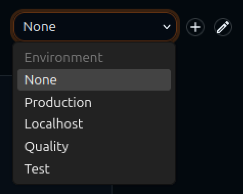

# mcp-sql

MCP server for JDBC-backed SQL access. It provides tools for SQL execution and schema introspection.
It is part of the [polymr platform](https://polymr-platform.github.io/).

## Features

1) Preview mode for DML by running query and rolling back transaction.

2) Dynamic introspection of SQL to determine which permissions are needed to run it, prompting for the ones that are not granted yet. This gives you full control to choose the level of autonomy you want the LLM agent to have. 

For example if database writing is not automatically approved, you can get a preview showing you exactly what change the LLM wants to do.


3) Can define multiple jdbc connections (with pooling), can use policy to dynamically switch one is the default, allowing easy environmental switching.




4) Supports SSH tunneling to reach databases.

5) Uses MCP Apps to show the results of a query in a table.

## Tools

### sql_query

Run SQL statements (SELECT/DML/DDL).

Input:
- `sql` (required): SQL statement
- `params` (optional): positional parameters for `?` placeholders
- `max_rows` (optional): override max rows for SELECT
- `offset` (optional): row offset for pagination (SELECT only)

Parameter mapping:
- JSON `null` binds as SQL `NULL`
- JSON numbers bind as numeric JDBC values
- JSON booleans bind as boolean JDBC values
- JSON strings bind as text
- JSON arrays bind as JDBC SQL arrays when all elements are scalar values

PostgreSQL vectors:
- Use `params` with a JSON array for the embedding, then cast it explicitly in SQL.
- Example with pgvector: `select * from documents where embedding = ?::vector`
- Example with distance operators: `select id, content from documents order by embedding <-> ?::vector limit 5`
- For plain PostgreSQL array columns, use a native array type in SQL, for example `where tags @> ?::text[]`
- Nested JSON arrays are passed through as nested JDBC arrays when supported by the driver, but pgvector itself expects a single 1-D vector value.
- If your pgvector setup requires a specific input format, keep the cast in SQL so the database handles the conversion.

### sql_inspect_schema

Inspect schemas, tables, columns, and relationships. Returns the database vendor.
If `search` is omitted, the tool only lists object names without column details.

## Development

Build the server:
```
mvn -q -DskipTests package
```

Build a native executable (requires GraalVM):
```
mvn -q -DskipTests -Pnative package
```
The binary is written to `target/mcp-sql` (or `target/mcp-sql.exe` on Windows).

Print the config schema:
```
java -jar target/mcp-sql-0.1.0-SNAPSHOT.jar --print-config-schema
```
